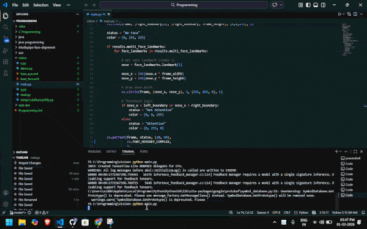

# Mediapipe-face-alignment

## Demo

Real-time facial landmark alignment monitoring using MediaPipe Face Mesh and OpenCV.

Overview:
This project captures live webcam input and uses MediaPipe’s pretrained Face Mesh model to extract facial landmarks in real time. The nose landmark is used as a spatial reference point to determine whether the face is centered within the frame. A simple threshold-based region classification approach is applied to label the face alignment as Attentive (centered) or Not Attentive (shifted left or right). The system also monitors runtime performance using FPS measurement.

Features:
Real-time webcam capture ||
MediaPipe Face Mesh integration (468 facial landmarks) ||
Landmark-based spatial alignment analysis (1 is nose) ||
Threshold-based classification logic  ||
FPS monitoring 

How It Works:
Capture frame from webcam. ||
Convert frame from BGR to RGB. ||
Process frame using MediaPipe Face Mesh. ||
Extract nose landmark (normalized coordinates). ||
Convert normalized values to pixel coordinates. ||
Define central alignment boundaries. ||
Apply threshold logic to classify face alignment. ||
Display classification and FPS on screen. ||

Technologies Used:
Python ||
OpenCV ||
MediaPipe |
